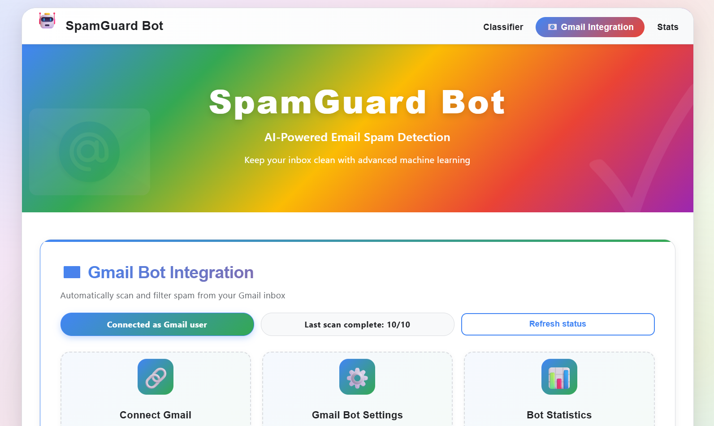

# SpamGuardBot

SpamGuardBot is a lightweight email spam detection and Gmail automation tool. It combines a TF-IDF feature extractor with a Multinomial Naive Bayes classifier to detect spam and optionally apply actions in Gmail (move to spam, add labels). The project includes a Flask API backend and a small frontend for quick demos.



## Key Features
- Real-time email classification through a REST API (`/api/classify`, `/api/batch-classify`).
- Automated Gmail scanning and actions (move to spam, add labels) via `GmailBot` integration.
- Explainability helper returning top contributing terms for a prediction.
- Model persistence: trained model saved to `spam_model.pkl` for fast startup.

## Architecture

```mermaid
flowchart LR
  A[User / Frontend] -->|POST /api/classify| B[Flask API (backend/app.py)]
  B --> C[SpamClassifier Pipeline]
  C --> D[(TF-IDF Vectorizer + MultinomialNB)]
  B --> E[GmailBot]
  E --> F[Gmail API]
  B --> G[Storage: json files & model files]
  subgraph Storage
    G
  end
```

The main components:
- Frontend: simple demo UI in `frontend/` that calls the Flask API.
- Backend API: `backend/app.py` exposes endpoints and loads the classifier asynchronously.
- Classifier: `backend/spam_classifier.py` — TF-IDF vectorizer + `sklearn.naive_bayes.MultinomialNB` inside an `sklearn.pipeline.Pipeline`.
- Gmail integration: `backend/gmail_bot.py` authenticates with Gmail and performs scanning/labeling/moving.

## Tech Stack
- Language: Python 3.8+
- Web: Flask + flask-cors
- ML: scikit-learn (TF-IDF + MultinomialNB)
- Gmail integration: google-auth, google-auth-oauthlib, google-api-python-client
- Packaging: requirements listed in `backend/requirements.txt`

## Model & Dataset
The classifier uses a TF-IDF vectorizer with a Multinomial Naive Bayes (`sklearn.naive_bayes.MultinomialNB`). Training is performed by `backend/spam_classifier.py` which expects a CSV dataset with `Category` and `Message` columns (values: `spam`/`ham`).

This repository uses the dataset originally available here (used for training / credit):

- Dataset: https://github.com/AkshaanAngral/Spam_Mail_Prediction/blob/main/mail_data.csv

If `mail_data.csv` is present in `backend/`, the trainer will load it automatically; otherwise the code falls back to a small built-in sample dataset for demonstration and testing.

## Quick Start (run locally)
1. Create a Python virtual environment and install requirements:

```bash
cd backend
python -m venv .venv
source .venv/bin/activate   # macOS / Linux
.venv\\Scripts\\activate     # Windows (PowerShell)
pip install -r requirements.txt
```

2. (Optional) Place your `mail_data.csv` dataset in `backend/` (CSV with `Category` and `Message` columns). If you used the linked dataset, include a copy or keep it external and point training at it.

3. Start the API server:

```bash
python app.py
```

4. Use the API:

POST `/api/classify` JSON body:

```json
{ "email_text": "Your email content here" }
```

Batch classify:

POST `/api/batch-classify` JSON body:

```json
{ "emails": ["email #1 text", "email #2 text"] }
```

## Gmail Integration
`backend/gmail_bot.py` handles Gmail OAuth flow (creates `token.pickle` after auth) and uses the Gmail API to read messages, classify them via the trained model, then optionally add labels or move to spam.

Be careful when using move/label features on a live account — test on a secondary account or enable only labeling first.

## File Structure

- `backend/` — Flask app, spam classifier, Gmail bot, models, and data
- `frontend/` — demo UI (static HTML/JS/CSS)
- `README.md` — this file

## Screenshots
Add screenshots to the `screenshots/` folder. Recommended images:
- `screenshots/demo-classify.png` — frontend classify flow
- `screenshots/gmail-actions.png` — example Gmail message moved/labeled

## Deployment Notes
- For production, run Flask behind a WSGI server (Gunicorn or Waitress on Windows) and secure your OAuth credentials.

## Proposed Cleanup (review before deletion)
I recommend reviewing and confirming deletions before they are applied. Candidates for removal (common generated files or redundant docs):

- `backend/gmail_scan_history.json`, `backend/gmail_scan_status.json`, `backend/gmail_status.json` — runtime state files that are generated; safe to delete if you want a clean repo.
- `start.sh`, `start.bat` — convenience scripts; keep if you want quick start scripts.
- Any `.pyc` or `__pycache__` folders — safe to delete (generated files).

Do you want me to remove the generated JSON state files and any `__pycache__` folders now? Reply yes to proceed and I'll delete only those safe-to-remove files.

## Contributing
Feel free to open issues or PRs. If you add new datasets, please note provenance and licensing.

## License
Add a license file (e.g., MIT) if you want to publish this project publicly.

---

If you'd like, I can: generate a more detailed architecture diagram file, commit a minimal `.gitignore` (to ignore `token.pickle`, `*.pkl`, `__pycache__`), and safely delete runtime JSON files now — tell me which of these to proceed with.
